## Overview
This folder containing scripts used plotting functions for major single-cell study analysis at cellular- or molecular- level.
Required packages are included in each script snippets. 

### Cellular level analysis
- UMAP visualization of cell metadata

- UMAP visualization of targeted label
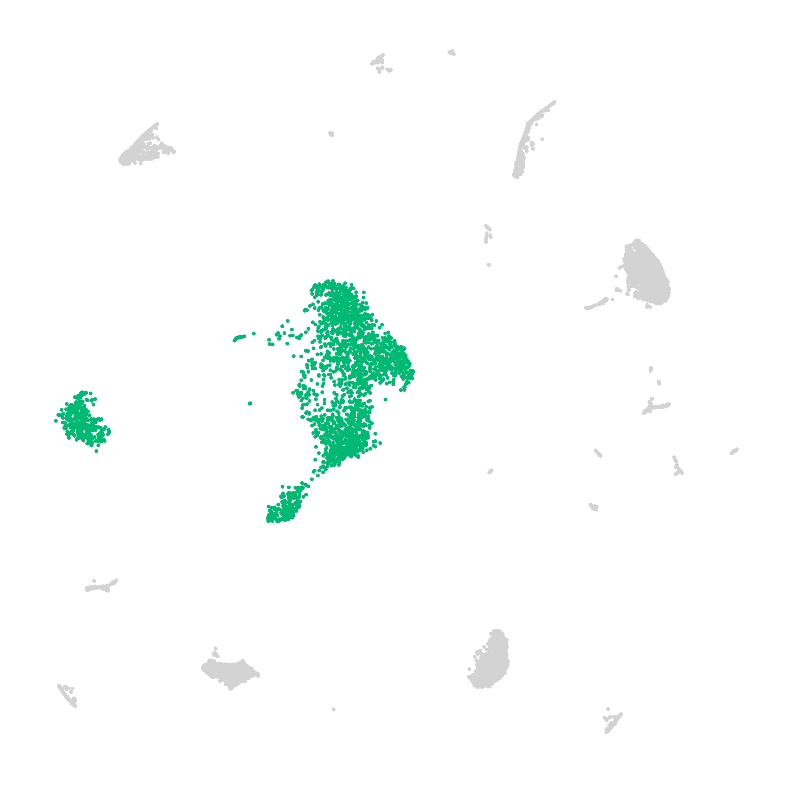

- UMAP visualization of cell density
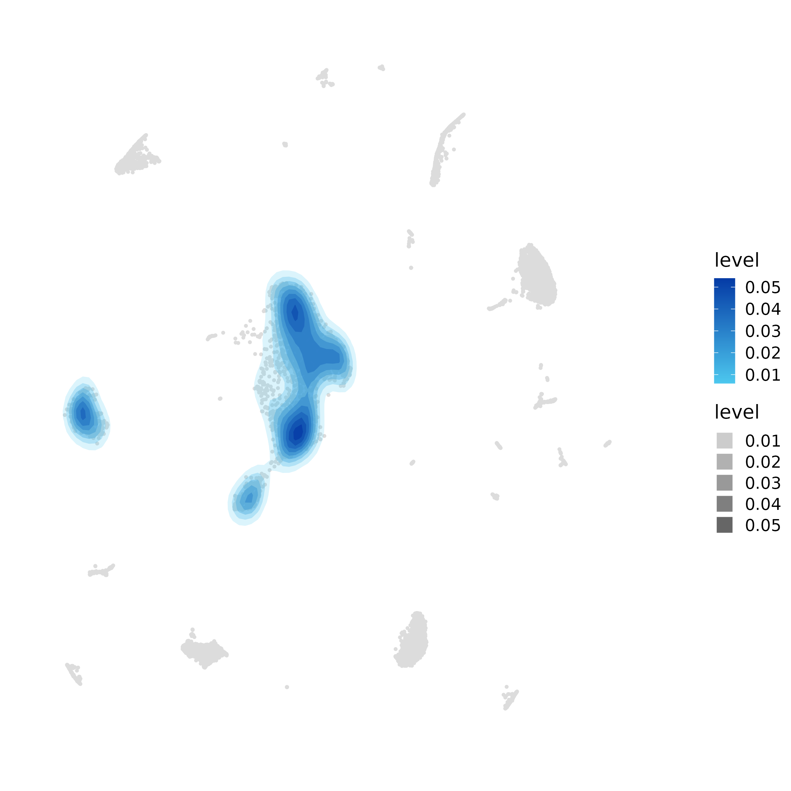

- Box plot for for cell proportion
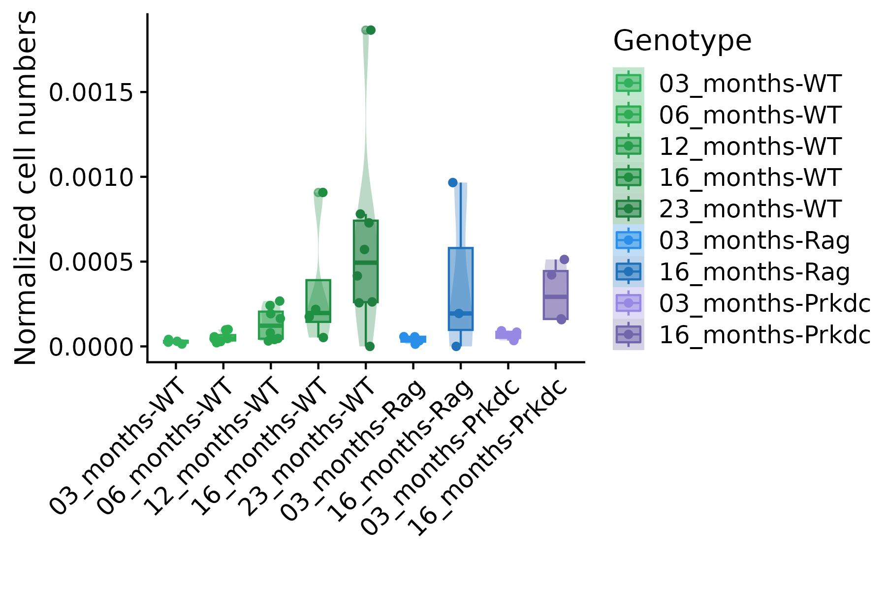

- Heatmap for cell proportion across experimental condition (aggregated proportion)

- Heatmap for cell proportion across experimental condition (by replicate)
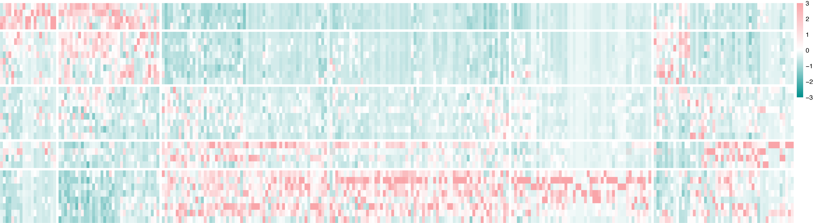

- Dot plot for cell-type-specific proportion changes
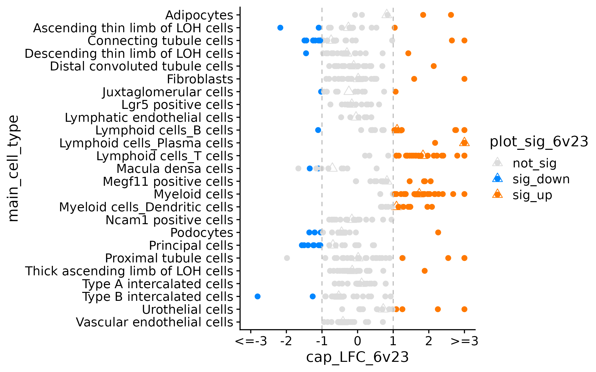

- Stacked bar plot for proportion of cell types from different lineage/organ
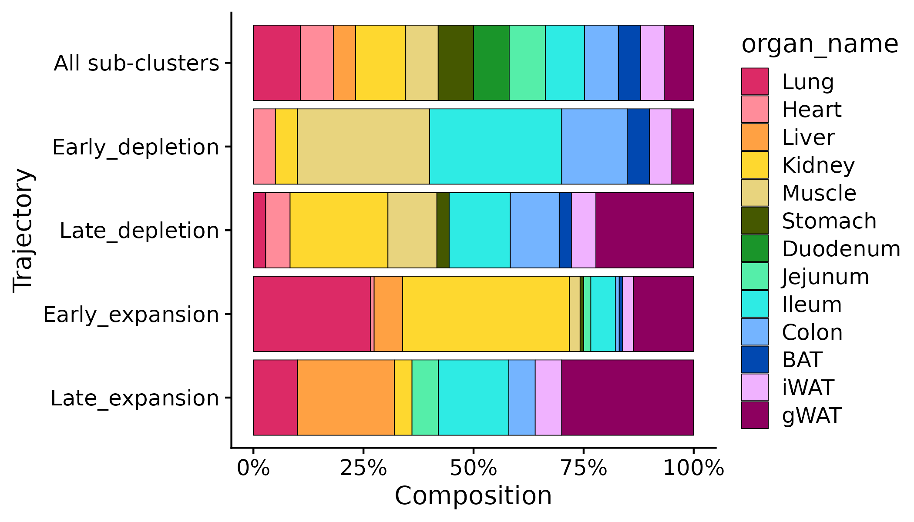

- Stacked bar plot with flows for cell population dynamics in different lineage/organ across age groups
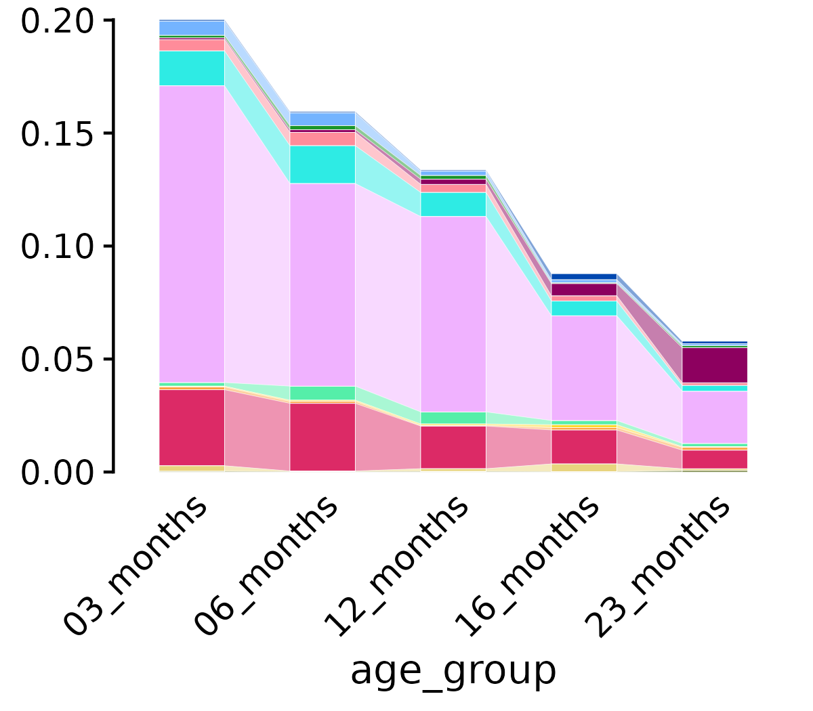

- Volcano plot for visualizing differentially aboundant cell types
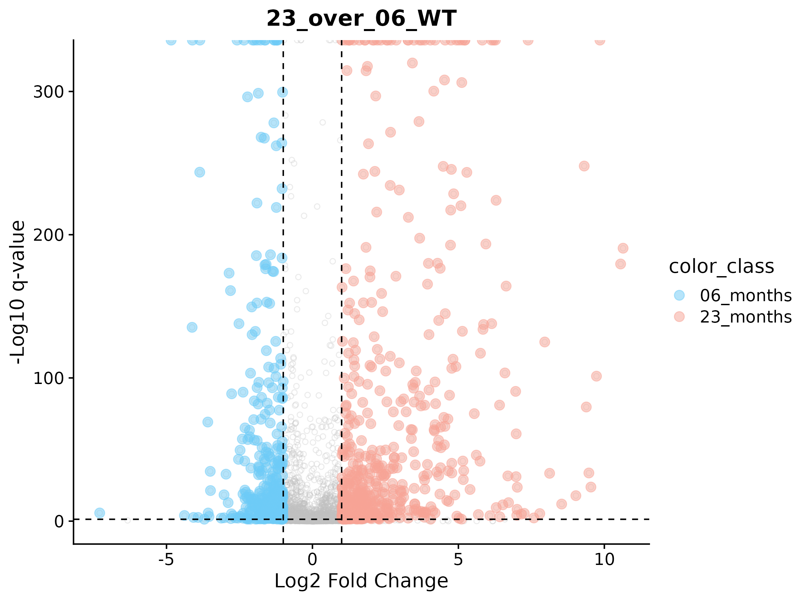

### Molecular level analysis
- UMAP visualization of targeted gene expression in each cell
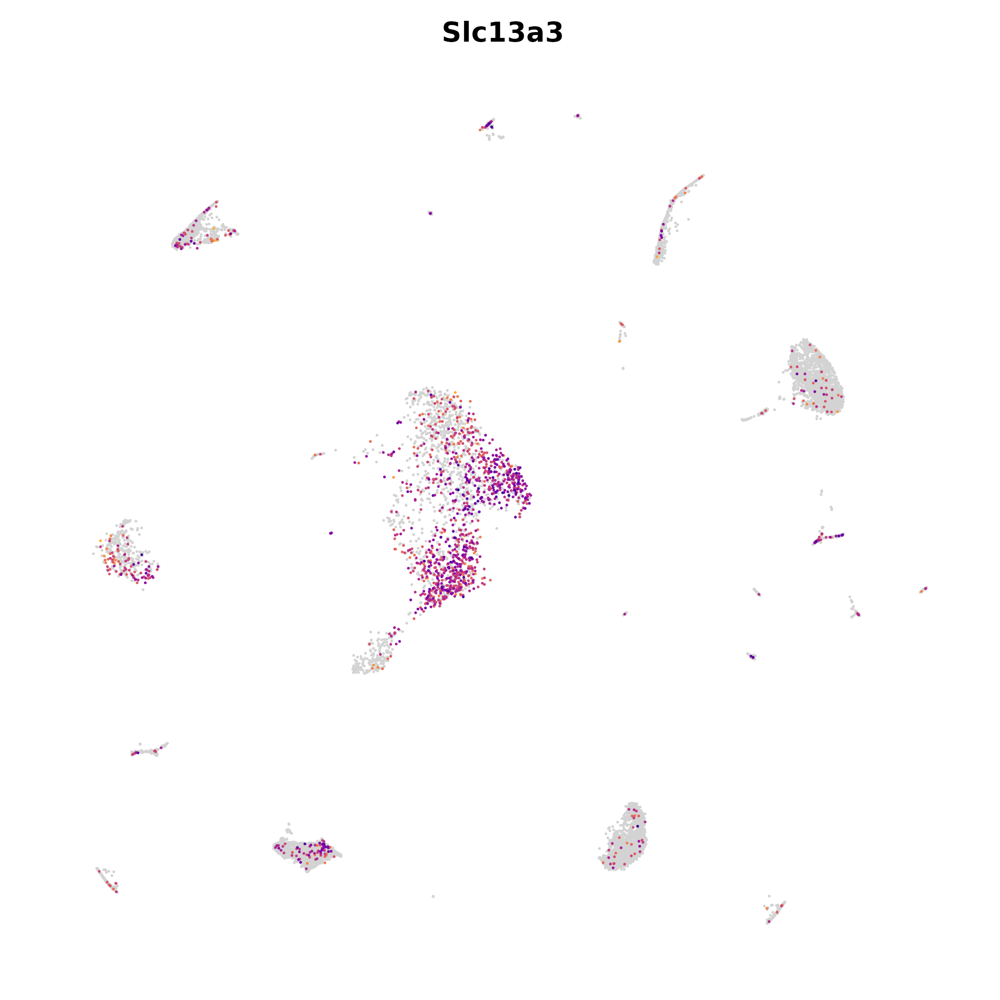

- UMAP visualization of targeted gene expression density
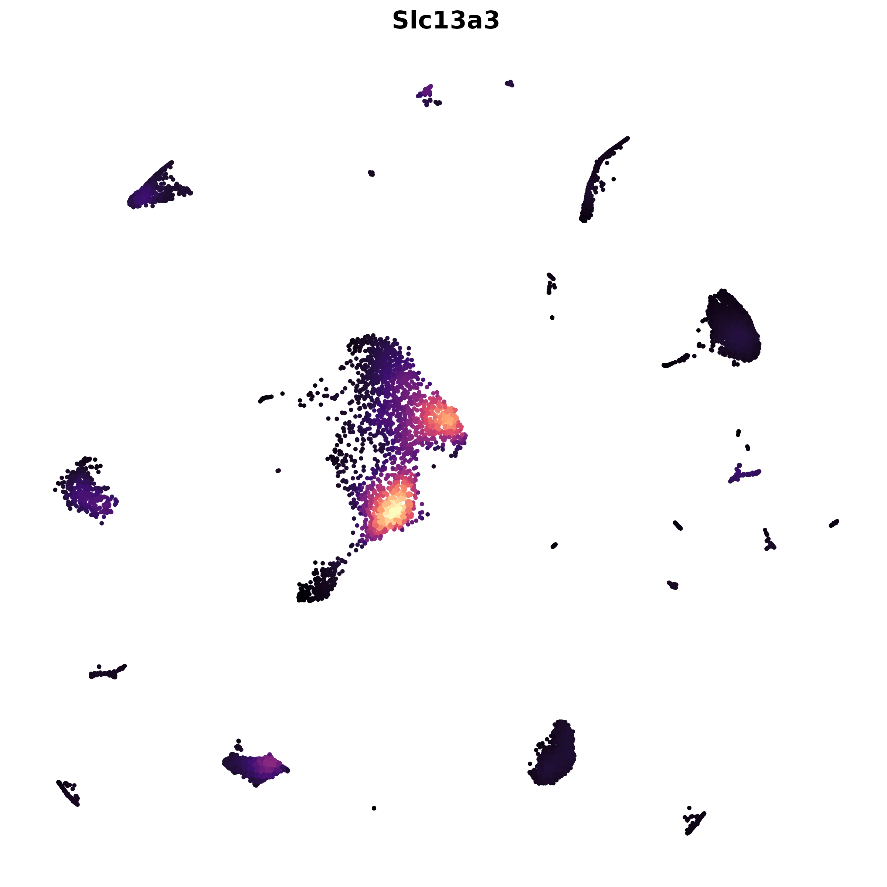

- Violin plot for targeted gene expression across cell types/conditions
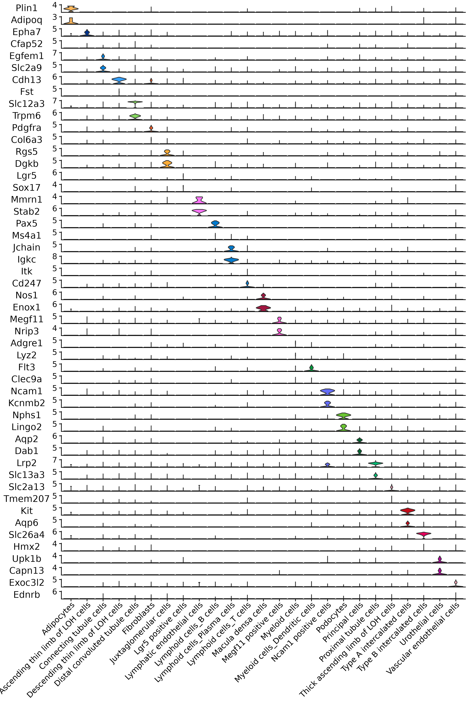

- Dot plot for targeted gene expression across cell types/conditions
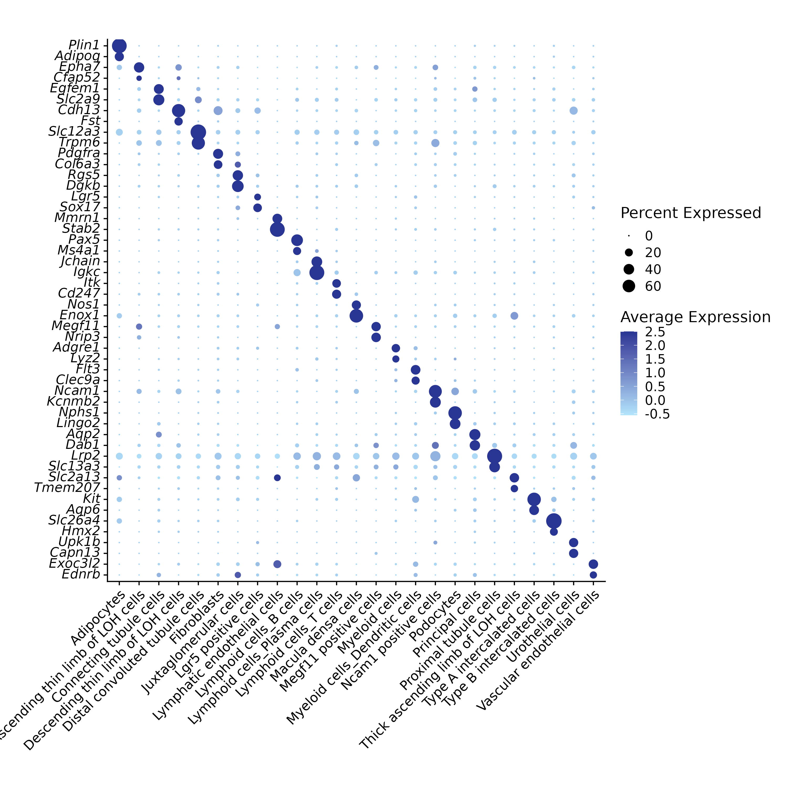

- Heatmap for targeted gene expression across cell types/conditions

- Boxplot for target gene expression

- Lollipop plot for the count of differentially expressed genes
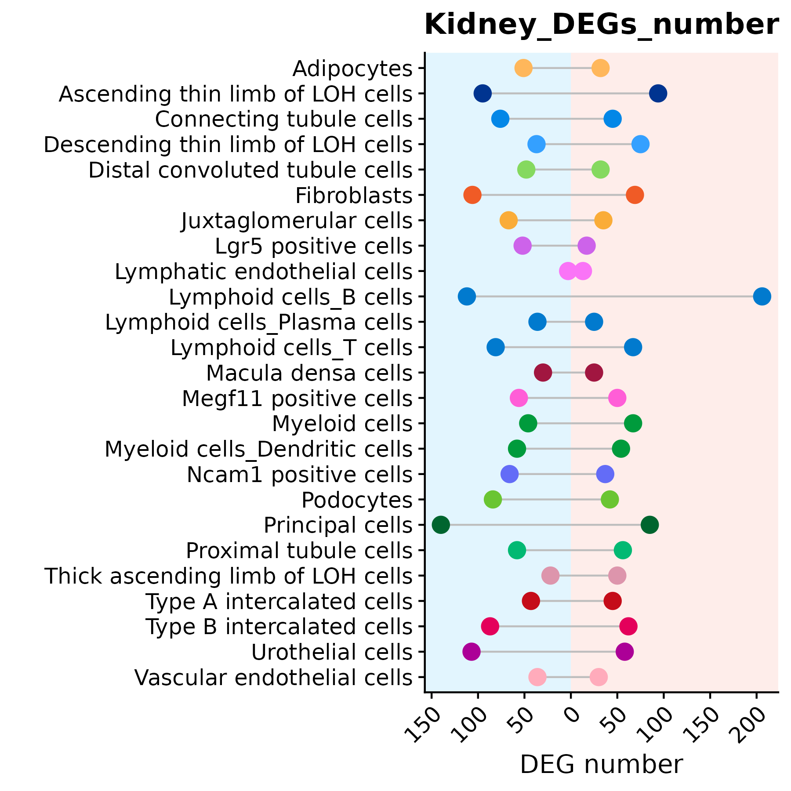

